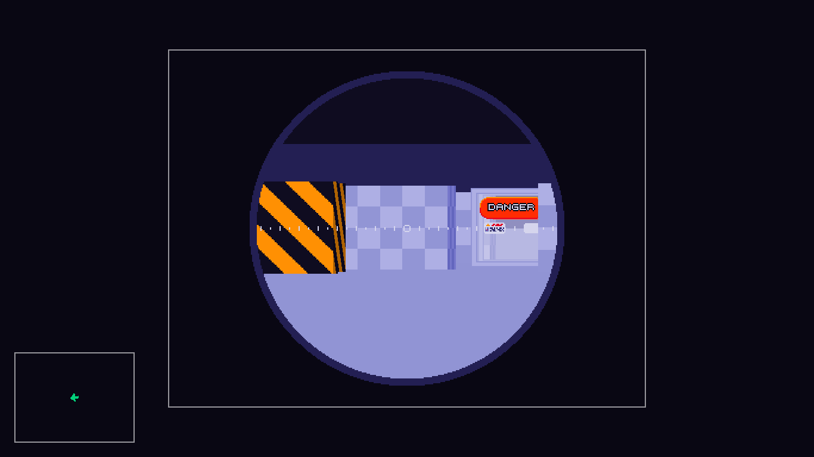

# Moonbase
_It's on the moon._  
  
Version: alpha  
Status:  Work-in-progress  
License: [GPL 3.0](LICENSE.md)

## Introduction

Moonbase is a [raycasting](http://en.wikipedia.org/wiki/Raycasting) engine built using [LÖVE](https://www.love2d.org). Raycasting is a method of rendering two-dimensional objects by projecting them onto a camera plane, providing a three-dimensional effect. Moonbase makes use of the Entity-Component-System design pattern to allow for emergent behavior and extensibility via composition.

## Features
* Configurable resolution
* Object transparency
* Camera zoom
* 360° skybox
* Fog of Void
* Customizable reticles, textures, icons, scopes, et cetera
* Outside and inside wall textures can be provided
* Absolute or relative world map
* Object highlighting
* Multiple cameras
* _... and more to come!_

## Controls
| Input        | Action                                              |
|:------------:|:---------------------------------------------------:|
| `W A S D`    | Move the camera                                     |
| `LEFT RIGHT` | Rotate the camera                                   |
| `LSHIFT`     | Zoom the camera (use scope)                         |
| `N`          | Add a new camera (does not change active camera)    |
| `H J K L`    | Select first/next/previous/last camera              |
| `LSHIFT`     | Zoom the camera (use scope)                         |
| `TAB`        | Toggle texture rendering                            |
| `Z`          | Toggle map zoom                                     |
| `M`          | Toggle map style                                    |
| `C`          | Toggle collider rendering on map                    |
| `ESC`        | Quit                                                |

## Screenshots

Initial screen:  

  
  
Transparent textures and differing side faces:  
  

  

Zoom / scope:  
  

  

Rendering without textures:  
  

